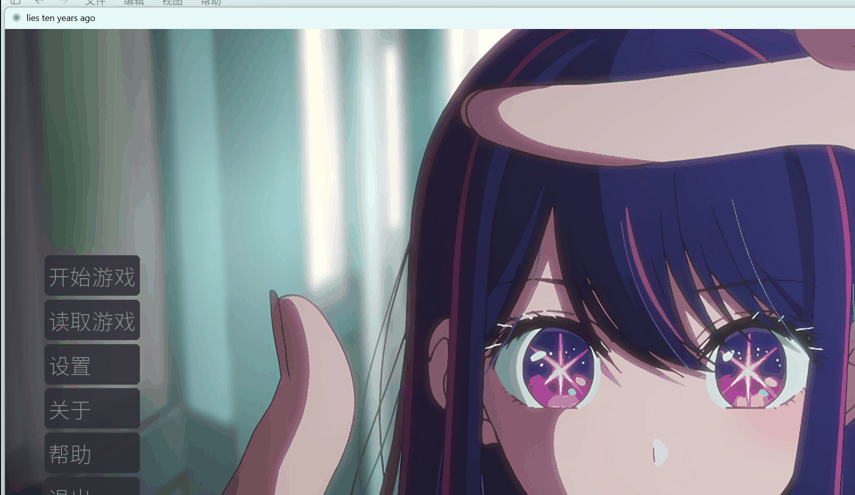

# 馃尭 璋庤█鍗佸勾 (Lies Ten Years Ago) 路 浜屾鍏冭瑙夊皬璇?
> **Ren'Py 寮曟搸 路 澶氳瑷€ 路 Android APK 鍙戝竷**
> A Ren'Py visual novel with multi-language support & Android builds

[](https://www.renpy.org/)
[](#)
[](#)
[](#)
[](LICENSE)

鍩轰簬 **Ren'Py** 寮曟搸鐨勪簩娆″厓瑙嗚灏忚锛圓VG锛夋父鎴忥紝璁茶堪鍗佸勾鍓嶈皫瑷€鑳屽悗鐨勬晠浜嬶紝宸插彂甯?Android APK銆?
A Chinese visual novel built with the Ren'Py engine 鈥?the story of a lie from ten years ago, released on Android APK.

## 馃摉 鏁呬簨绠€浠?Story

鍗佸勾鍓嶇殑涓€鍙ヨ皫瑷€锛屽浠婂浣曟敹鍦猴紵璺熼殢涓昏鍦ㄥ洖蹇嗕笌鐜板疄涓氦閿欏墠琛岋紝鎻紑鍩嬭棌澶氬勾鐨勭湡鐩搞€?
How does a lie from ten years ago come to an end? Walk between memories and reality to uncover the long-buried truth.

## 馃梻锔?椤圭洰缁勬垚 Project Structure

```text
game-project/       # Ren'Py 娓告垙椤圭洰
鈹斺攢鈹€ game/
    鈹溾攢鈹€ scripts/          # 娓告垙鑴氭湰
    鈹溾攢鈹€ tl/               # 澶氳瑷€鏂囨湰
    鈹溾攢鈹€ images/           # 绔嬬粯 路 CG 路 鑳屾櫙锛堝師鍒?AI 鐢熸垚绱犳潗锛?    鈹?  鈹溾攢鈹€ backgrounds/  # 鑳屾櫙鍥撅紙Web 鍘嬬缉鐗?JPG锛?    鈹?  鈹溾攢鈹€ heroine/      # 濂充富瑙掔珛缁?    鈹?  鈹斺攢鈹€ band/         # 涔愰槦瑙掕壊
    鈹溾攢鈹€ gui/              # 鐣岄潰
    鈹斺攢鈹€ SourceHanSansLite.ttf  # 鎬濇簮榛戜綋锛堝紑婧愬瓧浣擄級
```

## 鈻讹笍 杩愯 Run

浣跨敤 Ren'Py SDK 鎵撳紑 `game-project` 鐩綍鍗冲彲杩愯銆?
```powershell
# 涓嬭浇 Ren'Py SDK: https://www.renpy.org/latest.html
renpy.exe game-project
```

## 馃摑 Notes / 璇存槑

- 娓告垙鍚璇█鏂囨湰鐩綍 `game/tl/`锛屾敮鎸佸璇█
- 澶у瀷璇煶宸ュ叿涓庢ā鍨嬫枃浠讹紙COEIROINK銆佽闊冲寘绛夛級浣撶Н杈冨ぇ锛屾湭鍖呭惈鍦ㄤ粨搴撲腑
- 鑳屾櫙绱犳潗涓哄師鍒?AI 鐢熸垚骞跺帇缂╀负 JPG锛堝師鐗?PNG 鏈寘鍚級锛涚珛缁樹负鍘熷垱 AI 鐢熸垚 PNG锛堜繚鐣欓€忔槑閫氶亾锛?
## 馃搫 License

[MIT](LICENSE) 漏 2026 [sekai-lyr](https://github.com/sekai-lyr)


<p align="center">
  
</p>
---

**猸?If this project helped you, star it! 濡傛灉杩欎釜椤圭洰瀵逛綘鏈夊府鍔╋紝娆㈣繋 Star锛?*
